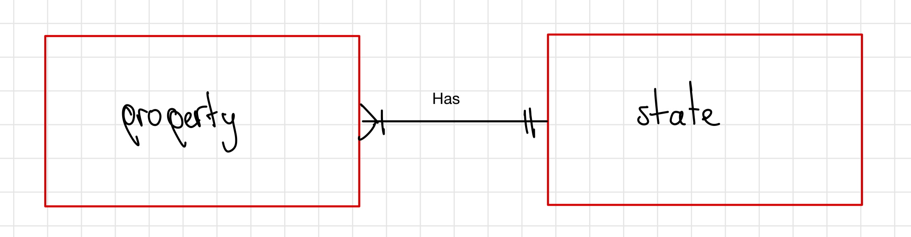

# Python Dependencies and Postgres set-up 
  ### Python:
  You'll need to install some libraries for **web scraping and parsing HTML text**:
  ```
  pip install beautifulsoup4
  pip install lxml
  pip install requests
  pip install python-dotenv
  ```

  For postgres manipulation with python we'll use 
  ```
  pip install psycopg2
  ```
  It's working on localhost, nevertheless if you're using 
  some other server, go ahead and change my server configuartion on `median_mode.py`.
  
  ### PostgreSQL:
  - Mac users: The easiest way to start working with postgreSQL on Mac is to install [Postgres.app]().
    
  - Windows/Linux: We're going to use the version provided by [PostgreSQL official website](https://www.postgresql.org/download/). Download
    the lastest stable version.
  
  In both cases, by installing postgres you'll also download a termimnal to manipulate database server. If you perfer to use you own one,
  add the activate command to your PATH or just copy and paste the activation link in your terminal.
  
  > [!IMPORTANT]
  > Be aware of ports managaging. If you've already downloaded Postgres, it's likely that you have still 5432 port opened
  > so you're not be able to start the server, so that, you'll need to troubleshoot its configuration or choose a different port.

# Design and description:

  ## General purpose:
   Store and managing real estate property listings scraped from the Inmuebles24 website for various states in Mexico. 
  
   These codes are designed to perform specific tasks related to obtaining and processing real estate data from all states of Mexico, as well as calculating basic 
   statistics on housing prices in those regions. Let's break them down into parts to understand how they work.

   **Divided in two main parts:**

   * First one is about getting the information by a website.
   * Second it's more about storing, cleaning and improving the database.
  
  ### Part 1: Data Retrieval
   
   **Functions:**
  `main():` Iterates over states and pages within each state to extract data.
  `get_status(url):` It makes HTTP requests to a URL until a successful response is obtained or a retry limit is reached.
> [!NOTE]
> It's better to use headers to simulate a web browser request and states which contains information about states and their
> corresponding URLs on inmuebles24.com.
  `extract_data(properties, state):` Extracts relevant information from each real estate property on a specific page.
  `parse_property_info(amenities):` Parses the features of a property to extract information such as square meters, rooms, bathrooms, and parking spaces.

  ### Part 2: Data Storage
   **psycopg2 Import:** This library enables connection and manipulation of PostgreSQL databases from Python.
   **Database Connection:** It establishes a connection to the specified database.
   **Database Cursor:** It creates a cursor to execute SQL queries.
   **Iteration over States:** It iterates over the list of states and executes SQL queries to calculate the median and mode of housing prices in each state.
   **Closing Connection:** Finally, it closes the connection to the database.

## DB Design:

### Entities
   1. **inm24**: Represents individual real estate properties.
   2. **states**: Stores information about different states including median price, mode price, and total properties recorded.

### Relationships
  - The `inm24` table is related to the `states` table through the `property_state` attribute, establishing a connection between property listings and their respective states.

### Optimizations
  1. **Indexes**: Indexes are created on `property_state` and `price` columns of the `inm24` table for efficient querying.
  2. **Views**: Views are created to present different perspectives of the data:
     - `inm24_no_description`: Excludes the `property_description` column.
     - `inm24_no_large_text`: Excludes large text columns (`property_description`).
     - `all_info`: Joins `inm24` and `states` tables to provide comprehensive property information along with state-level statistics.

### Limitations
  1. **Data Completeness**: The completeness of data depends on the availability of listings on the Inmuebles24 website.
  2. **Data Accuracy**: Accuracy of scraped data may vary and could be influenced by factors such as data entry errors or outdated listings.

The goal of this design document is to provide clarity and transparency regarding the structure, purpose, and limitations of the database, facilitating understanding and collaboration among stakeholders.

# real-state-data-warehouse
